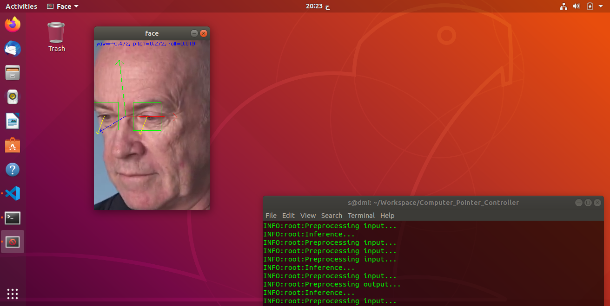

# Computer Pointer Controller

The Computer Pointer Controller main fucntionaly is moving the computer mouse using gazes of a person, to acheive that four deep learnnig models used: face detection model, landmarks estimation, head pose estimation and finally the gaze estimation.

## Project Set Up and Installation
*TODO:* Explain the setup procedures to run your project. For instance, this can include your project directory structure, the models you need to download and where to place them etc. Also include details about how to install the dependencies your project requires.

The project is organized in folders, the `src` folder is for the source code, the `bin` folder is for videos and images to use a input, the `models` folder is for the IR models
used in the project.

In order to get started with the application, you should first download the necessary models:


```
> source /opt/intel/openvino/bin/setupvars.sh

> cd /opt/intel/openvino/deployment_tools/tools/model_downloader/

> sudo pip3 install -r requirements.in

> sudo python3 downloader.py face-detection-adas-binary-0001

> sudo python3 downloader.py landmarks-regression-retail-0009

> sudo python3 downloader.py head-pose-estimation-adas-0001

> sudo python3 downloader.py gaze-estimation-adas-0002

```

After downloading the needed IR models for the execution of the application, yo are ready to install the application dependencies:

```
> sudo pip3 install -r requirements.txt
```

## Demo

The following shows a demonstartion about the application:



The following the link to visualize the video:

https://youtu.be/1SN6S4XHxig


## Documentation

In order to run the application, you can keep it simple and take the arguments as default by using the below command, in this case the models used are `FP32`, the visualization of the models outputs is activated and the `CPU` is used as the device for all the models:

```
> python3 src/main.py -i bin/demo.mp4  
```

If you want to know more you could use `--help` to get all the possible options:

```
usage: main.py [-h] [-i INPUT] [-m_fd MODEL_FD] [-m_ld MODEL_LD]
               [-m_hpe MODEL_HPE] [-m_ge MODEL_GE] [-d_fd {CPU,GPU,FPGA,VPU}]
               [-d_ld {CPU,GPU,FPGA,VPU}] [-d_hpe {CPU,GPU,FPGA,VPU}]
               [-d_ge {CPU,GPU,FPGA,VPU}] [-e_fd EXT_FD] [-e_ld EXT_LD]
               [-e_hpe EXT_HPE] [-e_ge EXT_GE] [-v_fd] [-v_ld] [-v_hpe]
               [-v_ge]

optional arguments:
  -h, --help            show this help message and exit
  -i INPUT, --input INPUT
                        Path to the input video
  -m_fd MODEL_FD, --model_fd MODEL_FD
                        Face detection model name path
  -m_ld MODEL_LD, --model_ld MODEL_LD
                        Landmarks detection model name path
  -m_hpe MODEL_HPE, --model_hpe MODEL_HPE
                        Head pose estimation model name path
  -m_ge MODEL_GE, --model_ge MODEL_GE
                        Gaze estimation model name path
  -d_fd {CPU,GPU,FPGA,VPU}, --device_fd {CPU,GPU,FPGA,VPU}
                        Face detection device
  -d_ld {CPU,GPU,FPGA,VPU}, --device_ld {CPU,GPU,FPGA,VPU}
                        Landmarks detection device
  -d_hpe {CPU,GPU,FPGA,VPU}, --device_hpe {CPU,GPU,FPGA,VPU}
                        Head pose estimation device
  -d_ge {CPU,GPU,FPGA,VPU}, --device_ge {CPU,GPU,FPGA,VPU}
                        Gaze estimation device
  -e_fd EXT_FD, --ext_fd EXT_FD
                        Face detection model extension
  -e_ld EXT_LD, --ext_ld EXT_LD
                        Landmarks detection model extension
  -e_hpe EXT_HPE, --ext_hpe EXT_HPE
                        Head pose estimation model extension
  -e_ge EXT_GE, --ext_ge EXT_GE
                        Gaze estimation model extension
  -v_fd, --vis_fd       Face detection visualization
  -v_ld, --vis_ld       Landmarks detection visualization
  -v_hpe, --vis_hpe     Head pose estimation visualization
  -v_ge, --vis_ge       Gaze estimation visualization

```

## Benchmarks
*TODO:* Include the benchmark results of running your model on multiple hardwares and multiple model precisions. Your benchmarks can include: model loading time, input/output processing time, model inference time etc.

## Results
*TODO:* Discuss the benchmark results and explain why you are getting the results you are getting. For instance, explain why there is difference in inference time for FP32, FP16 and INT8 models.

## Stand Out Suggestions
This is where you can provide information about the stand out suggestions that you have attempted.

### Async Inference
If you have used Async Inference in your code, benchmark the results and explain its effects on power and performance of your project.

### Edge Cases
There will be certain situations that will break your inference flow. For instance, lighting changes or multiple people in the frame. Explain some of the edge cases you encountered in your project and how you solved them to make your project more robust.
